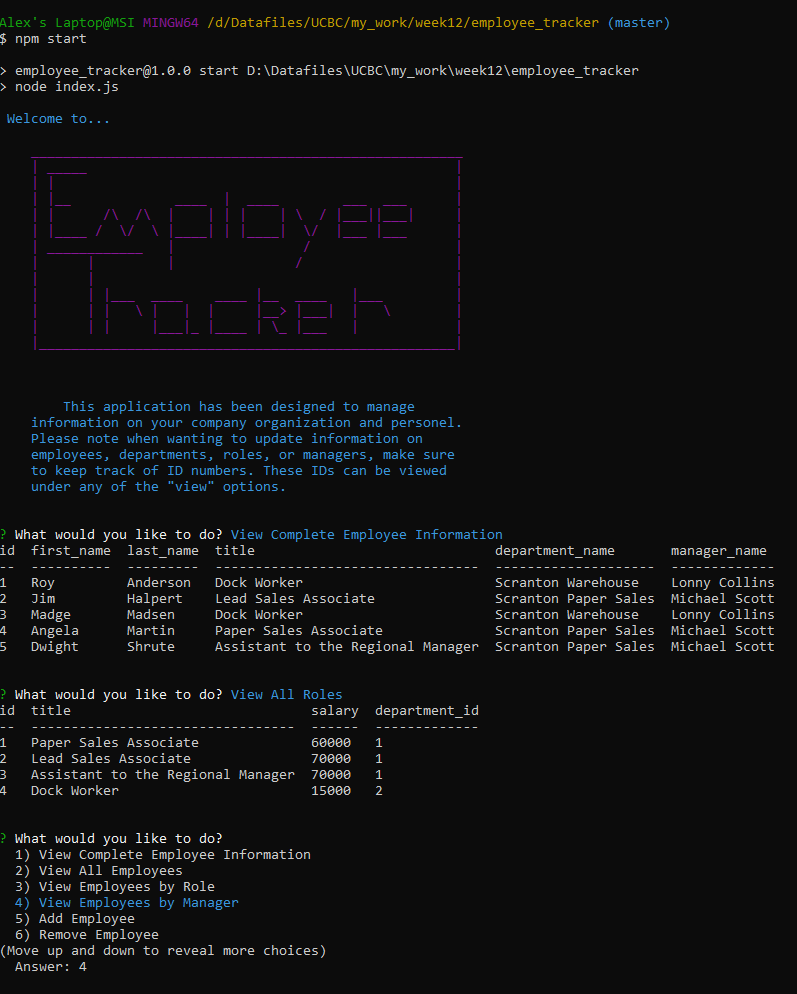

# Employee Tracker


## Description
Employee Tracker is an interactive node.js application used to store important information for a company, such as employee information, role descriptions and department organization. This project is specifically designed to utilize a mySQL database and query the data through the terminal.



## Table of Contents
- Installation
- Usage

### Installation
Run the following line in the git terminal:

```git
npm install
```

Installed packages included in this application are mySQL, inquirer, and console.table.

### Usage
Run application in the git terminal:

```git
npm start
```

"index.js" initializes the application with console log instructions to the user and calling the main inquirer function "selectOptions()". "inquirer_prompts.js" contains all inquirer calls to the user and "use_sql.js" writes queries to the mySQL database.


*© 2020 ajhami - Alexander James Hamilton. All Rights Reserved.*
